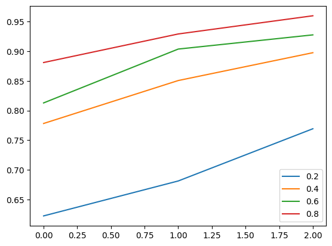
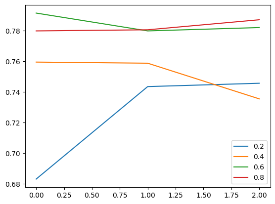
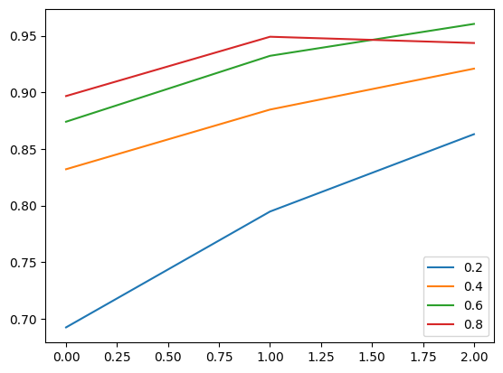
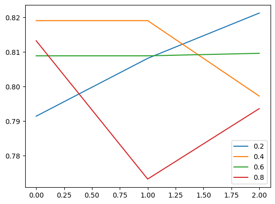

# Code-Mixed Sentence Generation and Language Model Fine-Tuning

Machine learning has found extensive applications in various domains, including the monitoring of social media content for automatic flagging of abusive data. However, one challenge arises when dealing with "non-formal" language, often in the form of code-mixed framed sentences. These sentences, which combine multiple languages, pose difficulties for categorization using traditional machine learning models. The goal of this assignment is to create code-mixed sentences using a monolingual English corpus and evaluate the performance of fine-tuned language models on a standard code-mixed dataset.

## Problem Statement

In this project, I aim to implement a data creation strategy for generating code-mixed sentences by leveraging a standard translator from a monolingual Hindi corpus, specifically the HASOC 2019 Hindi dataset. Additionally, I will create code-mixed data with various code-mixing indices (CMI), and fine-tune pre-trained Language Models (LLMs), including BeRT and m-BeRT. The performance of these models will be compared in terms of CMI versus accuracy and BeRT versus m-BeRT performance. It is important to perform necessary preprocessing, such as data cleaning, before fine-tuning the LLM.

## Project Tasks

1. **Dataset Selection**: I have utilized the Hindi 2019 dataset from the HASOC Dataset as our monolingual Hindi corpus. This dataset contains labeled data related to abusive content on social media platforms like Twitter.

2. **Code-Mixed Sentence Generation**: I have employed a standard translator to generate code-mixed sentences from the monolingual Hindi corpus. The code-mixing index (CMI) will be varied (Here, I've used CMI of _0.2_, _0.4_, _0.6_ and _0.8_) to create code-mixed data with different degrees of language mixing with _0.2_ consisting of _20%_ English and _80%_ Hindi words. I have stored these code-mixed dataset in separate CSV files to access it later without having to compute it over and over. 

3. **Data Preprocessing**: Before fine-tuning the language models, I have allowed the standard _cased_ Preprocessors from TensorFlow Hub to pre-process the data in each case. I have used two different Preprocessor in each Monolingual (English) and Multilingual model. I have left the special character _**'#'**_ in place, so that it could be tokenized and the model could utilize its information.

4. **Language Model Fine-Tuning**: I have fine-tuned two pre-trained language models, BeRT and m-BeRT, using the generated code-mixed data. Fine-tuning involves training the models on the specific task and dataset to enhance their performance for code-mixed sentence classification.

5. **Performance Evaluation**: The fine-tuned models will be evaluated on each of the four code-mixed dataset. I have measured their performance in terms of accuracy and compare the results against different code-mixing indices (CMI) to assess the impact of language mixing on accuracy. Furthermore, I have compare the performance of BeRT and m-BeRT to analyze the differences and justify the observations.

## Results

### Monolingual BeRT Model

We first evaluated the performance of the monolingual BeRT model on code-mixed data with varying code-mixing indices (CMI). The following graphs illustrate the train accuracy and test accuracy of the model as the CMI score increases:

Train Accuracy vs epochs over various CMI |  Test Accuracy vs epochs over various CMI
:-------------------------:|:-------------------------:
  |  
  
From the graphs, we can observe an interesting trend. As the CMI score increases, the train accuracy of the monolingual BeRT model increases gradually. This indicates that the model faces challenges in accurately predicting the code-mixed sentences with lower language mixing.

Similarly, the test accuracy of the model also exhibits mostly an increase trend as the CMI score increases. This implies that the performance of the monolingual BeRT model increases when exposed to code-mixed data with higher language mixing.

### Multilingual BeRT Model

Next, we examined the performance of the multilingual BeRT model on the same code-mixed data with varying CMIs. The following graphs depict the train accuracy and test accuracy of the model across different CMI scores:

Train Accuracy vs epochs over various CMI |  Test Accuracy vs epochs over various CMI
:-------------------------:|:-------------------------:
  |  

The graphs reveal intriguing insights. Unlike the monolingual BeRT model, the train accuracy of the multilingual BeRT model remains _relatively more_ stable across different CMI scores. This suggests that the model is more resilient to code-mixed sentences with varying degrees of language mixing.

Similarly, the test accuracy of the multilingual BeRT model also remains _relatively more_ consistent as the CMI score increases. This indicates that the model can handle code-mixed data with lower language mixing more effectively compared to the monolingual BeRT model.

## Discussion
The following graphs shows the train accuracy of the two model across different CMI scores:

BeRT (Monolingual English) |  m-BeRT (Multilingual)
:-------------------------:|:-------------------------:
  |  

The results obtained from the experiments with both the monolingual and multilingual BeRT models provide valuable insights into their performance on code-mixed data with varying CMIs. The monolingual BeRT model demonstrates a clear increase in train and test accuracy as the CMI score increases, indicating the model's difficulty in accurately classifying sentences with lower CMI score, i.e. having more Hindi words.

On the other hand, the multilingual BeRT model exhibits greater robustness across different CMI scores. The train and test accuracies are not showing a direct behavior as they did in the case of monolingual model, implying that the multilingual model is more adaptable to code-mixed data with varying degrees of language mixing. However, there is still more ease in the recognition for the English words, it seems. Either way, we definitely see the increase in accuracies in the performance in the lower CMI score datasets. Also, we can see a huge improvement in the test acuracy in the lower CMI scores in the multilingual model. It can be because the model had more training experience in recognizing the Hindi words and, thus, it gave better results over the test datasets.

These findings suggest that incorporating multilingual capabilities in language models can enhance their ability to handle code-mixed content effectively. By leveraging a wider linguistic context, the multilingual BeRT model demonstrates improved performance on code-mixed sentences compared to the monolingual BeRT model.

## Conclusion

This project aims to address the challenge of categorizing code-mixed sentences using fine-tuned language models. By generating code-mixed data with varying code-mixing indices and fine-tuning BeRT and m-BeRT models, we can evaluate their performance on a standard code-mixed dataset. The project provides insights into the impact of language mixing on model accuracy and compare the performance of different language models. The project also sheds light on the advantages of using a monolingual model and explore the potential enhancements that can be achieved by leveraging a multilingual language model in real-world applications. The findings from this project can contribute to the development of more effective techniques for handling code-mixed content in machine learning applications, particularly in the context of social media content monitoring and abuse detection.

### Acknowledgement 
Special thanks to [SAiDL](https://www.saidl.in/) for providing the problem statement.
